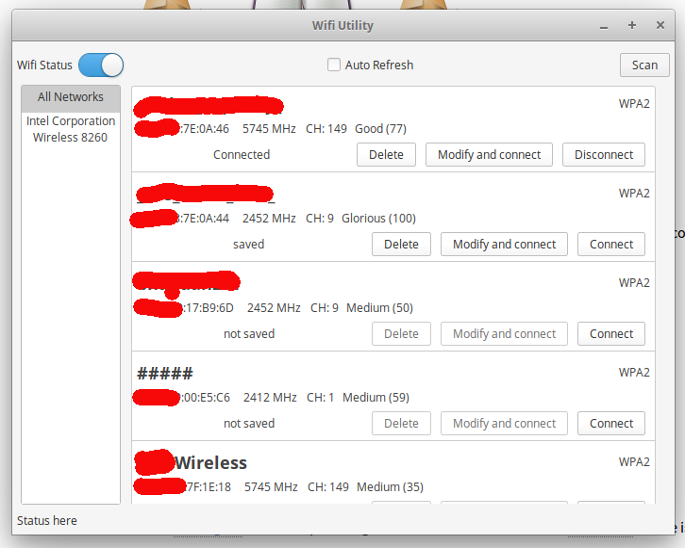
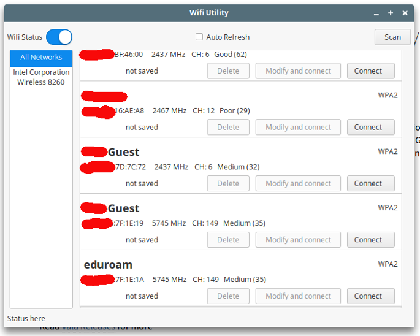
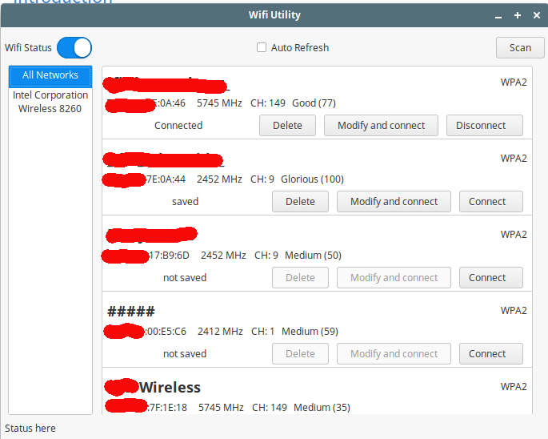

# Wi-Fi management utility for Linux

As is often the case with mesh or university networks, many access points have the same name but operate on different channel/frequency, providing different wireless bandwidth. Windows has [Wifi Manager](https://www.netsetman.com/en/wifi-wlan-manager) or [WirelessMon](http://wirelessmon.com/) utilities that lets you connect to a network with specific MAC address. In my short search, I could not find such a GUI tool for Linux, so I decided create one. This is my attempt at it, and while it does the core job well, some bugs remain and some features are yet to be implemented.

## The Software

Written with [Vala](https://wiki.gnome.org/Projects/Vala), the tool integrates with the OS theme well as it uses GTK+, shows access points on different network cards (or all together), lets the user scan, connect, disconnect, delete a profile and turn Wi-Fi on/off. It even includes a small IPv4 configuration utility, though the OS provided one is perfectly fine and feature rich.

The main window, with a Wi-Fi adapter and access point list


Separation of two access points with same name according to their MAC address (*****-Guest)


Theming support, according to OS theme


Note, access point names and the first three octets of MAC address have been removed to protect privacy.

## Building

You must have `make`, `ruby~>1.9`, `valac`, `libgtk-3-dev`, `libnm-glib-dev`, `libnm-util-dev` installed in your system. 
```bash
sudo apt install make ruby valac libgtk-3-dev libnm-glib-dev libnm-util-dev
```

Run the generator script
```bash
ruby ./generator.rb
```

This should create the `res.xml` and `Makefile`.

Finally run `make`, this should build a release executable. See makefile for other options.

Run the executable using `./builds/release/run` and check for correct operation.

## To do

1. Fix ipv4 config related bugs
2. Support WPA2 Enterprise 
3. Add documentation for `build_opt.yaml`
4. Rewrite `generator.rb`, it is an ugly mess